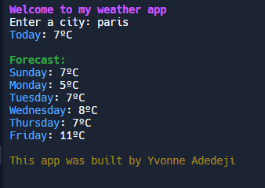

# python-weather-app

## 📌 Description
This Weather App is a simple command-line application that fetches and displays current weather conditions and a forecast for a given city. It uses the SheCodes weather API to retrieve weather data and presents it in a readable format with enhanced styling using the rich library.

## 🛠 Prerequisites
Before running this project, ensure you have the following installed:
* Python 3.x
* requests library
* rich library

## 📋 Criteria
* Accepts a city name as user input
* Fetches real-time weather data
* Displays current temperature
* Provides a forecast for upcoming days
* Includes a simple, user-friendly command-line interface

## 💻 Technologies Used
The application is built with the following technologies:
* Python: Main programming language
* Requests: For making API calls
* Rich: For formatting output with colors and styling
* SheCodes Weather API: To retrieve weather data

## 🚀 Installation
No installation is required to use the app. It is hosted online and can be accessed via a web browser.

## 📚 Usage
1. Run the script.
2. Enter the name of the city you want to check the weather for.
3. View the current weather and forecast.

## 🔗 Live Demo & Repository
Application can be viewed here: 
* [Live](https://replit.com/@yvonnesarah/Python-Weather-App#main.py)

* [Repository](https://github.com/yvonnesarah/python-weather-app)

## 🖼 Screenshot
Below is a preview of Python Weather App:

## 👥 Credit
N/A

## 📜 License
This project is open-source. For licensing details, please refer to the LICENSE file in the repository.

## 📬 Contact
You can reach me at 📧 yvonneadedeji.sarah@gmail.com.
